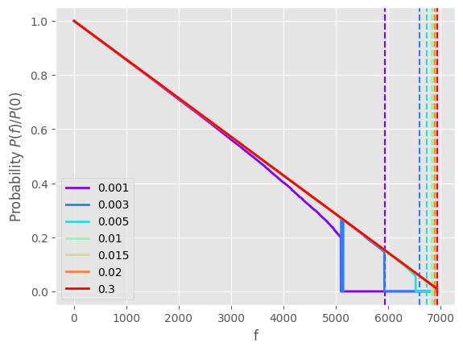

# Introduction

In this work, we want to try and tackle the topic of network robustness, both for random networks and for more realistic network topologies.

With the term robustness, we mean the capacity of a network to keep it's connected nature under node failure, both randomized and targeted. 
This should be a reasonable way to approach the idea of the resilience of a network to both random failure of components and targeted attacks, and allow us to lay the groundwork for more advanced studies, such as enhancing robustness, recognizing more vulnerable or higher priority targets and more.

To analyze the topic, we'll use the conceptual and mathematical framework defined by Percolation Theory, a branch of mathematics that studies the evolution on networks when nodes and edges are added.

# Percolation Theory

The origin of the name stems from the question posed in the 1957 paper that originated the filed: If liquid is poured of a porous material, does the liquid flow through the cavities until reaching the bottom?

Percolation theory models this phenomenon as a 3D lattice structure where nodes represent holes in the material and links possible passages between these cavities. Thus, creating a statistical model for the porous material.

The filed has expanded as a branch of mathematics and statistical physics and is quite richly explored, with applications now ranging in ecology, biology, biochemistry, virology, statistical modeling and, as we'll show, network science.

## Lattices and networks

[Check wording, perhaps some basic images of percolation structures]

Lattices are the most common model used in percolation theory, constructing a regular network where nodes are connected only to their relative neighbors in a regular pattern. These can be square, triable, hexagon, 2D, 3D, 4D.

All these share some common properties, given by the number of dimensions. The parameters that define these properties are called *Critical Exponents*.

These networks are generated by placing the nodes in our lattice, and associating the edges with a random $X_i \thicksim Ber(p)$ variable. Each edge exists only if $X_i = 1$, so each edge has the same probability $p$ of existing.

One of the key findings of percolation theory is that many key properties of the generated graph, such as average cluster size or likelihood of reachability between nodes, are not linked directly with the evolution of $p$. 
Instead, there is a key value $p_c$ called *Critical probability*, and when $p>p_c$ the network structure changes: The smaller cluster connect and a major network component, usually called *percolating cluster*, appears and connects the majority of the network. 

Here, the role of the critical exponents can become much clearer:
$$
\begin{aligned}
d &\thicksim \lvert p-pc \lvert ^{-\gamma_p} \\
p_{\infty}&\thicksim(p-pc)^{\beta_p} \\
\xi&\thicksim \lvert p-pc \lvert ^{-\nu}
\end{aligned}
$$

These three equations connect our probability $p$ with the properties: 

 - d - Average Cluster Size  

 - $P_\infty$ - Order Parameter: probability that single node connects to the percolation cluster

 - $\xi$ - Correlation Length: average distance between members of the same cluster

So, the network evolves quickly into a large unified structure when the $p_c$ threshold is crossed.

Conversely, this process can be looked in reverse, starting from a fully formed and connected network: removing nodes with a small probability $f$, until the major connected component fails, and the network is completely shattered.

This allows us to reframe the problem of network robustness into a percolation problem.

Much like the creation process, this *Inverse Percolation* is not a smooth process but an abrupt one, where the network can reroute most connections and paths until a value $f_c = 1-p_c$ called *Critical Threshold*, is reached and the network collapses.

All these processes and the values governing them can be computed for the aforementioned lattices, but have also been studied and analyzed for other topologies, such as random networks or Scale-Free models. This allows Percolation theory to model failures over a wide range of network types.

To model the interconnectedness of the network we'll consider only one of the previously identified parameters: $P_\infty$, more specifically the ratio $\Large \frac{P_{\infty}(f)}{P_{\infty}(0)}$ comparing the original network's Order Parameter to the value after a removal with probability $f$.

We'll also be computing the Molly-Reed Criterion, which allows us to estimate analytically the critical threshold parameter, comparing it with our empirical results.

[ugly passage]
The last component to introduce is the distribution $k$ of the degrees of the nodes, of which we'll use different values like moments or maximum values in various occurrences.

In the rest of the work we'll be showing the results of these analyses for various types of networks and verifying the theoretical results on both artificial and real datasets.

[get new page for this]
# Random networks

The first network we model is an Erdős–Rényi random graph. This model has a given number of nodes and edges are connected randomly. 

This model is a relatively simple and common one, derived in 1959, although it's not considered to be effective in mimicking most network topologies of interest, it is nonetheless useful as an example, and its properties are all well studied

As such, these random networks can be analyzed directly under percolation theory as infinite-dimension lattices, and have well-defined critical exponents.
Specifically, $\gamma_p$ = 1, $\beta_p$ = 1 and $\nu$ = 1/2.

The Expected threshold we get for random networks is $f_c = 1-\frac{1}{ \langle k \rangle}$. This result comes also from the fact that random networks such as these follow a Poisson distribution for node degrees, which makes the threshold computation easier.

## Impact of random failures
Here we give a simple visualization of a randomly generated graph using the Erdős–Rényi method. he dotted line gives us the computed critical threshold for each network.

The Distribution follows closely the expected Poisson, and shows that the average degree of the nodes is $\thicksim 300$, in line with our expectations. The graph clearly shows a highly connected example, and further analysis will consider networks with lower $p$ values.

These graphs show how the network responds to randomized failures of its nodes, up to 99% of them. We can see that, apart from catastrophic failures, the trend is one of high resistance of networks, as long as the probability $p$ is not too low. 

Random graphs show themselves to be quite resistant to node failures, although under the hypothesis of having enough connections between nodes.
These extra connections act as a backup for the network, allowing it to keep its structure even under heavy failures. 

A clear issue with these models is that random graphs are not likely to occur in nature or under unconstrained environments, as they often display a high degree of redundancy, which raises their cost and lowers their efficiency.

# Scale-Free Networks

As previously stated, random networks are not an effective model for real world networks. A more recent model that tries to bridge this gap between theory and practice is the Scale Free model, which uses a Power Law distribution for the degrees of the nodes. This leads to the existence of a few major Hubs in the networks, which act as the backbone of the network.

This difference can already give us an idea of the response of the network against random failures: most nodes are inconsequential to the overall network connectedness, and only the removal of the major hubs impacts the network.

Unlike random networks, the critical exponents of scale free models are not uniquely defined by the topology itself, instead depending on the degree exponent $\gamma$ of the Power Law of the network.

This dependency on $\gamma$ is also reflected on the expected critical threshold value:

$$
f_c = \begin{cases}
   1-\frac{1}{\frac{\gamma-2}{3-\gamma}k_{min}^{\gamma-2}k_{max}^{3-\gamma}-1} &\text{if } 2 < \gamma < 3 \\
   1-\frac{1}{\frac{\gamma-2}{\gamma-3}k_{min}-1} &\text{if } \gamma > 3
\end{cases}
$$

## Impact of random failures
These graphs show the properties of the generated Scale Free networks.

The parameter $\gamma$ is computed using a fit function to get the best estimate, and the graphs shows that it maps quite nicely with the true distribution of the network.

The graph visualization also highlights effectively the major roles of some nodes compared to others. The regular structure we saw in the random networks is substituted with a strong hierarchy, where a handful of nodes have a major role in the network.

Here we execute the same node removal algorithm, graphing also the expected threshold of the networks. We slightly different networks to get a more general understanding of the problem, alongside different network sizes to see if any property emerges.

We can observe that the networks are less stable compared to the random ones we saw previously, and we can notice major drops in network connectivity, likely due to a group of major nodes being removed. The network is still relatively stable, as a high percentage of nodes has to fail to cause major damage to the graph, and if the major nodes can be protected from these failures, we can expect even better performance.

# Real world networks

# Targeted failures

## Impacts on random networks

## Impacts on scale-free networks

## Impacts on real world networks

